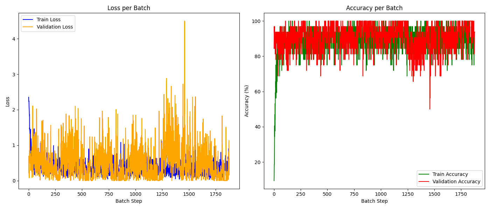

# Классификация MNIST (NumPy + Pandas)
## Описание проекта
### Этот проект — с нуля написанная реализация свёрточной нейронной сети (CNN) на базе чистого NumPy и Pandas для классификации рукописных цифр из датасета MNIST.

Функционал:

- Полностью кастомные слои сети и функции активации

- Оптимизатор Adam с поддержкой weight decay и настройкой learning rate

- Функция потерь Cross-Entropy

- Пайплайн для аугментации данных

- Собственный DataLoader с поддержкой аугментаций

- Логирование процесса обучения

- Визуализация метрик по эпохам

- Сохранение весов модели в .npy

- Автоматизированный скрипт для установки и обучения

## Структура проекта

```bash

├── Augmentations
│   └── augs.py                   # Функции аугментации данных (шум, повороты, отражения)
├── Layer
│   ├── activations.py            # Активационные функции (ReLU)
│   ├── base_layer.py             # Базовый класс слоя
│   ├── conv_2d.py                # Свёрточный слой 2D
│   ├── fc.py                     # Полносвязный слой
│   ├── flatten.py                # Слой "развёртки" тензора
│   └── max_pool_2d.py            # MaxPooling слой
├── Loss
│   └── ce.py                     # Функция потерь CrossEntropy
├── Model
│   └── model.py                  # Архитектура модели (свёрточная сеть)
├── Optimizer
│   └── adam.py                   # Adam оптимизатор с L2-регуляризацией
├── Utils
│   ├── metrics.py                # Метрики (accuracy, precision, recall)
│   ├── tensor.py                 # Простая реализация тензора
│   └── tools.py                  # Вспомогательные функции: yaml конфиги, DataLoader, логирование, графики
├── configs
│   └── config.yaml               # Конфигурационный файл проекта
├── main.py                       # Главный скрипт для запуска обучения
├── requirements.txt              # Список зависимостей проекта
├── train.py                      # Функция обучения и валидации модели
└── train.sh                      # Bash-скрипт автоматизации обучения
```

Установка и запуск проекта
Скачайте проект и перейдите в директорию проекта.

Убедитесь, что у вас установлен Python 3.10+.

Дайте права на исполнение скрипта:

```bash
chmod +x train.sh
```


Запускайте скрипт для обучения!
```
./train.sh
```

## Нюансы
После завершения обучения вы получите:

Сохранённые веса модели в папке, указанной в configs/config.yaml (model/weights.npz)

Графики обучения и валидации (graphics/)

## Результаты




